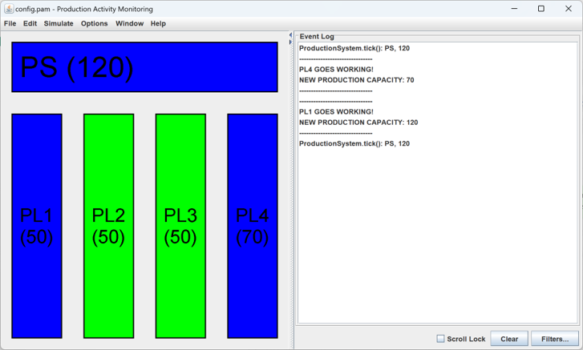
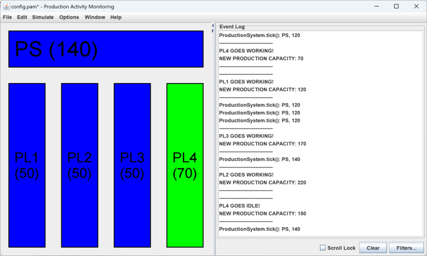
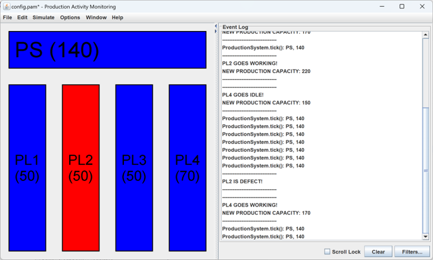

# demoproductionsystem

Production system demonstrator of the ESC component framework

Shows especially:
* Expansions in order to handle state machines
* Agent-oriented programming via proactively detecting its environment by Tick events


## Highlights
A production system and its production lines proactively observe their environment via Ticks. They find their optimal workload this way:







Expansions are a way to extend the Component interface. In order to establish a state machine they can react situation-specific:

```Java
@Service(type=ProductionLine.class, inherits=ProductionAgent.class)
public class ProductionLineImpl {

   @Expansion private ProductionLineState state;
   @Expansion private PLRole role;
   …
   @Tick(activateMethod="startTick", deactivateMethod="stopTick", 
      suspendMethod="suspendTick", resumeMethod="resumeTick")

   public void tick() {
      System.out.println("ProductionLine.tick(): " + thiz);
      role.tick();
   }
}
```
